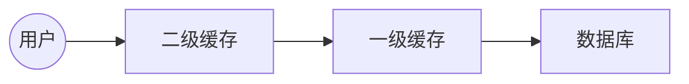


# Mybatis笔记
## 第一个Mybatis程序
### 编写Mybatis工具类
1. 获取SqlSessionFactory对象。
2. 从SqlSessionFactory获得SqlSession实例。
	- SqlSession包含了面向数据库执行SQL命令的所有方法。
### 编写代码
- 实体类：
	```java
	public class User {  
	    private int id;  
		private String name;  
		private String pwd;  
  
		public User() {  
	    }  
  
	    public User(int id, String name, String pwd) {  
	        this.id = id;  
			this.name = name;  
			this.pwd = pwd;  
		}  
  
	    public int getId() {  
	        return id;  
	  }  
  
	    public void setId(int id) {  
	        this.id = id;  
	  }  
  
	    public String getName() {  
	        return name;  
	  }  
  
	    public void setName(String name) {  
	        this.name = name;  
	  }  
  
	    public String getPwd() {  
	        return pwd;  
	  }  
  
	    public void setPwd(String pwd) {  
	        this.pwd = pwd;  
	  }  
  
	    @Override  
		public String toString() {  
	        return "User{" +  
                "id=" + id +  
                ", name='" + name + '\'' +  
                ", pwd='" + pwd + '\'' +  
                '}';  
		}  
	}
	```
- Dao接口：
	```java
	public interface UserDao {  
	    List<User> getUserList();  
	}
	```
- 接口实现类由原来的UserDaoImpl转变为一个Mapper配置文件：
	```xml
	<?xml version="1.0" encoding="UTF-8" ?>  
	<!DOCTYPE mapper PUBLIC "-//mybatis.org//DTD Mapper 3.0//EN"  
	 "http://mybatis.org/dtd/mybatis-3-mapper.dtd">  
	<!--namespace绑定一个对应的Dao/Mapper接口-->  
	<mapper namespace="com.kuang.dao.UserDao">  
	 <select id="getUserList" resultType="com.kuang.pojo.User">  
	  SELECT * FROM mybatis.user  
    </select>  
	</mapper>
	```
### 测试
#### 注意：把xml文件直接放到resource文件夹中。
```java
public class UserDaoTest {  
    @Test  
  public void test(){  
        SqlSession sqlSession = MybatisUtils.getSqlSession();  
  UserDao mapper = sqlSession.getMapper(UserDao.class);  
  List<User> userList =mapper.getUserList();  
 for (User user : userList) {  
            System.out.println(user);  
  }  
        sqlSession.close();  
  }  
}
```
## CRUD实现
1. 编写接口。
2. 编写对应mapper中的sql语句。
3. 测试。
### namespace
- namespace中的包名要和Dao/Mapper接口的包名一致。 
### 标签select、insert、update、delete
- id：对应的namespace中的方法名。
- resultType：sql语句执行的返回值。
- parameterType：参数类型。
### 注意：
- 增删改需要提交事务。
### 分析错误
- 标签不能匹配错。
- resource绑定mapper，需要使用路径。
- 程序配置文件要符合规范。
### 使用Map
```java
//接口
int addUser2(Map<String,Object> map);
```
```xml
<!--mapper配置-->
<insert id="addUser2" parameterType="map">  
  insert into mybatis.user(id,name,pwd) values(#{userId},#{userName},#{passWord});  
</insert>
```
```java
//测试
@Test  
public void addUserTest2(){  
    SqlSession sqlSession = MybatisUtils.getSqlSession();  
 try{  
        UserMapper mapper = sqlSession.getMapper(UserMapper.class);  
  Map<String, Object> map = new HashMap<>();  
  map.put("userId",5);  
  map.put("userName","王五");  
  map.put("passWord","7897898");  
 int res=mapper.addUser2(map);  
 if(res>0){  
            System.out.println("插入成功");  
  }  
  sqlSession.commit();  
  }catch (Exception e){  
        e.printStackTrace();  
  }finally {  
        sqlSession.close();  
  }  
}
```
- 如果实体类的属性或表的字段过多，可考虑使用Map。
### 模糊查询
- 在sql拼接时使用通配符。
	```sql
	select * from mybatis.user where name like "%"#{value}"%"
	```
## 配置解析
### 核心配置文件
- 一般命名为mybatis_config.xml。
- Mybatis的配置文件包含了会影响Mybatis行为的设置和属性信息。
- 需要注意标签的顺序。
### 环境配置（environments）
- Mybatis可以配置适应多种环境。
- 尽管可以配置多个环境，每个SqlSessionFactory实例只能选择一种环境。
- Mybatis默认的事务管理器是JDBC，连接池：POOLED
### 属性（properties）
- 可以通过属性（properties）来实现引用配置文件。
- 在核心配置文件中引入：
	```xml
	<!-- 引入外部配置文件-->  
	  <properties resource="db.properties">  
		 <property name="password" value="111111"/>  
	 </properties>
	```
	- 可以直接引入外部文件。
	- 引入时可以增加属性配置。
	- 如果有重复字段，优先使用外部配置文件中的。
### 类型别名（typeAliases）
- 方式1：给实体类起自定义别名：
	```xml
	<typeAlias type="com.kuang.pojo.User" alias="User"/>
	```
- 方式2：扫描指定包中的类，默认别名为这个类的类名，首字母小写。
	```xml
	<package name="com.kuang.pojo"/>
	```
- 方式3：通过注解起别名，优先级高于方式2，低于方式1。
	```java
	//在User.java中
		@Alias("hi")
	```
### 设置（settings）
详见：[MyBatis-XML配置-设置(settings)](https://mybatis.org/mybatis-3/zh/configuration.html#settings)
### 映射器（mappers）
MapperRegistry：注册绑定Mapper文件。
方式1：
```xml
<mappers>  
 <mapper resource="UserMapper.xml"/>  
</mappers>
```
### 生命周期和作用域
- 生命周期和作用域非常重要，错误使用会导致并发问题。
#### SqlSessionFactoryBuilder：
- 创建了SqlSessionFactory之后就不再需要。
- 作为局部变量。
#### SqlSessionFactory：
- 可以视作数据库连接池。
- 一旦被创建，在应用运行的期间一直存在，不需要重新创建另一个实例。
- 最佳作用域是应用作用域。
- 使用单例模式或静态单例模式。
#### SqlSession：
- 连接到连接池的一个请求。
- SqlSession的实例不是线程安全的，因此不能被共享。最佳作用域是请求或方法作用域。
- 使用完后需要即时关闭。
## 解决属性名和字段名不一致的问题
### 方式1：起别名
```sql
select id,name,pwd password from mybatis.user where id=#{id};
```
### 方式2：使用resultMap（结果集映射）
```xml
<!-- 结果集映射-->  
  <resultMap id="UserMap" type="User">  
<!--        column：数据库中的字段名 property：实体类中的属性-->  
  <result column="pwd" property="password"/>  
<!--        <result column="id" property="id"/>-->  
<!--        <result column="name" property="name"/>-->
 </resultMap>
```
- resultMap的设计思想：对于简单的语句不需要配置显式的结果映射，对于复杂一点的语句只需描述它们的关系。
## 日志
### 日志工厂
需要掌握：
- STDOUT_LOGGING
- LOG4J

在Mybatis中在设置（settings）中使用logImpl，设定具体使用哪个日志实现。
### STDOUT_LOGGING 标准日志输出
在Mybatis的核心配置文件中配置日志：
```xml
<settings>  
 <setting name="logImpl" value="STDOUT_LOGGING"/>  
</settings>
```
### LOG4J
- 需要导入log4j的包。

 log4j.properties：
```properties
log4j.rootLogger=DEBUG,console,file  
#控制台输出相关配置  
log4j.appender.console=org.apache.log4j.ConsoleAppender  
log4j.appender.console.Target=System.out  
log4j.appender.console.Threshold=DEBUG  
log4j.appender.console.layout=org.apache.log4j.PatternLayout  
log4j.appender.console.layout.ConversionPattern=[%c]-%m%n  
#文件输出相关配置  
log4j.appender.file=org.apache.log4j.RollingFileAppender  
log4j.appender.file.File=./log/my.log  
log4j.appender.file.MaxFileSize=10mb  
log4j.appender.file.Threshold=DEBUG  
log4j.appender.file.layout=org.apache.log4j.PatternLayout  
log4j.appender.file.layout.ConversionPattern=[%p][%d{yy-MM-dd}][%c]%m%n  
#日志输出级别  
log4j.logger.org.mybatis=DEBUG  
log4j.logger.java.sql=DEBUG  
log4j.logger.java.sql.Statement=DEBUG  
log4j.logger.java.sql.ResultSet=DEBUG  
log4j.logger.java.sql.PreparedStatement=DEBUG
```
#### 简单使用
1. 在需要使用Log4j的类中导入包`org.apache.log4j.Logger`。
2. 日志对象，参数为当前类的class
	 ```java
	 static Logger logger=Logger.getLogger(UserMapperTest.class);
	 ```
## 分页
- 可以减少数据的处理量。
### 使用limit分页
```sql
select * from mybatis.user limit #{startIndex},#{pageSize};
```
1. 接口中：
	```java
	//分页  
	List<User> getUserByLimit(Map<String,Integer> map);
	```
2. Mapper.xml中：
	```xml
	<!-- 分页-->  
	<select id="getUserByLimit" resultMap="UserMap" parameterType="map">  
	  select * from mybatis.user limit #{startIndex},#{pageSize};  
   </select>
	```
3. 测试类中：
	```java
	@Test  
	public void getUserByLimitTest(){  
	    SqlSession sqlSession = MybatisUtils.getSqlSession();  
		UserMapper mapper = sqlSession.getMapper(UserMapper.class);  
		Map<String, Integer> map = new HashMap<>();  
		map.put("startIndex",1);  
	    map.put("pageSize",2);  
	    List<User> userList = mapper.getUserByLimit(map);  
	    for (User user : userList) {  
	        System.out.println(user);  
	    }  
	    sqlSession.close();  
	}
	```
### 使用RowBounds分页
1. 接口中：
	```java
	List<User> getUserByRowBounds();
	```
2. Mapper.xml中：
	```xml
	<!-- 分页2-->  
	<select id="getUserByRowBounds" resultMap="UserMap">  
	  select * from mybatis.user;  
	</select>
	```
3. 测试类中：
	```java
	@Test  
	public void getUserByRowBoundsTest(){  
	  SqlSession sqlSession = MybatisUtils.getSqlSession();  
	  //RowBounds实现  
	  RowBounds rowBounds = new RowBounds(1,2);  
	  //在Java代码层面实现分页  
	  List<User> userList = sqlSession.selectList("com.kuang.dao.UserMapper.getUserByRowBounds",null,rowBounds);  
	  for (User user : userList) {  
	        System.out.println(user);  
	  }  
	  sqlSession.close();  
	}
	```

## 使用注解开发
1. 注解在接口上实现
	```java
	@Select("select * from user")  
	List<User> getUsers();
	```
2. 需要在核心配置文件中绑定接口
	```xml
	<mappers>  
	 <mapper class="com.kuang.dao.UserMapper"/>  
	</mappers>
	```
3. 测试
	- 本质：反射机制实现。
	-  底层：动态代理。
	```java
	@Test  
	  public void test(){  
	    SqlSession sqlSession = MybatisUtils.getSqlSession();  
		UserMapper mapper = sqlSession.getMapper(UserMapper.class);  
		List<User> users = mapper.getUsers();  
		for (User user : users) {  
	        System.out.println(user);  
		}  
		sqlSession.close();  
	}
	```
### 使用注解进行CRUD
在接口中：
```java
//如果方法存在多个参数，所有参数前必须加上@Param("")注解  
@Select("select * from user where id=#{id}")  
User getUserById(@Param("id") int id);  
@Insert("insert into user(id,name,pwd) values (#{id},#{name},#{password})")  
int addUser(User user);  
@Delete("delete from user where id=#{id}")  
int deleteUser(@Param("id") int id);  
@Update("update user set name=#{name},pwd=#{password} where id=#{id}")  
int updateUser(User user);
```
#### 关于@Param注解
- 在基本类型的参数或String类型前需要添加。
- 引用类型前不需要添加。
- 如果只有一个基本类型的参数，可以忽略不加。
- sql语句中引用的是@Param()中设定的属性名。
## Lombok
- 通过使用注解自动生成构造器、getter/setter等方法。
- 一些常用注解：
	- @Data  
	- @AllArgsConstructor  
	- @NoArgsConstructor
## 多对一处理
### 查询嵌套处理（子查询）
```xml
<select id="getStudentList" resultMap="StudentTeacher">  
  select * from student;  
</select>  
<resultMap id="StudentTeacher" type="Student">  
 <result property="id" column="id"/>  
 <result property="name" column="name"/>  
<!-- 复杂属性需要单独处理 对象：association 集合：collection-->  
  <association property="teacher" column="tid" javaType="Teacher" select="getTeacher"/>  
</resultMap> 
<select id="getTeacher" resultType="Teacher">  
  select * from teacher where id=#{id};  
</select>
```
### 结果嵌套处理（联表查询）
```xml
<select id="getStudentList2" resultMap="StudentTeacher2">  
  select s.id sid,s.name sname,t.name tname  
    from student s,teacher t  
    where s.tid=t.id;  
</select>  
<resultMap id="StudentTeacher2" type="Student">  
 <result property="id" column="sid"/>  
 <result property="name" column="sname"/>  
 <association property="teacher" javaType="Teacher">  
  <result property="name" column="tname"/>  
 </association>
</resultMap>
```
## 一对多处理
### 结果嵌套
```xml
<select id="getTeacher" resultMap="TeacherStudent">  
    select s.id sid,s.name sname,t.name tname,t.id tid  
    from student s,teacher t  
    where s.tid=t.id and t.id=#{tid};  
</select>  
<resultMap id="TeacherStudent" type="Teacher">  
 <result property="id" column="tid"/>  
 <result property="name" column="tname"/>  
 <collection property="students" ofType="Student">  
  <result property="id" column="sid"/>  
  <result property="name" column="sname"/>  
 </collection>
</resultMap>
```
### 查询嵌套
```xml
<select id="getTeacher2" resultMap="TeacherStudent2">  
  select * from teacher where id=#{tid};  
</select>  
<resultMap id="TeacherStudent2" type="Teacher">  
 <result property="id" column="id"/>  
   <collection property="students" javaType="ArrayList" ofType="Student" select="getStudentByTeacherId" column="id"/>  
</resultMap>  
<select id="getStudentByTeacherId" resultType="Student">  
  select * from student where tid=#{tid};  
</select>
```
### 小结
- 多对一：association
- 一对多：collection
- javaType：用于指定实体类中属性的类型。
- ofType：用于指定映射到List或集合中的pojo类型（泛型里的约束类型），比如上例中的Student。
## 动态SQL
- 动态SQL指根据不同的条件，生成不同的SQL语句。
### if
1. 在接口中：
	```java
	// 查询博客  
	  List<Blog> queryBlogIF(Map map);
	```
2. 在Mapper配置文件中：
	```xml
	<select id="queryBlogIF" parameterType="map" resultType="Blog">  
		select * from blog 
	    <where>  
			<if test="title!=null">  
			  and title=#{title}  
			</if>  
			<if test="author!=null">  
			  and author=#{author}  
			</if>  
		</where>  
	</select>
	```
3. 在测试类中：
	```java
	@Test  
	  public void queryBlogIFTest(){  
        SqlSession sqlSession = MybatisUtils.getSqlSession();  
		BlogMapper mapper = sqlSession.getMapper(BlogMapper.class);  
		Map map = new HashMap();  
	//        map.put("title","Java");  
		map.put("author","小明");  
	    List<Blog> blogList = mapper.queryBlogIF(map);  
        for (Blog blog : blogList) {  
            System.out.println(blog);  
        }  
        sqlSession.close();  
   }
	```
### choose、when、otherwise、where
```xml
<select id="queryBlogChoose" parameterType="map" resultType="Blog">  
  select * from blog  
    <where>  
	 <choose> 
		 <when test="title!=null">  
			  title=#{title}  
         </when>  
		 <when test="author!=null">  
			  and author=#{author}  
         </when>  
		 <otherwise>  
			 and views=#{views}  
	     </otherwise>  
	 </choose>
	</where>
 </select>
```

### set
	```xml
	<update id="updateBlog" parameterType="map">  
	  update blog  
	  <set>  
	  <if test="title!=null">  
		  title=#{title},  
	  </if>  
      <if test="author!=null">  
		  author=#{author}  
      </if>  
	 </set>  where id=#{id}  
	</update>
	```
### trim
- trim会移除所有 _prefix/suffixOverrides_ 属性中指定的内容，并且插入 _prefix/suffix_ 属性中指定的内容。
	```xml
	<trim prefix="" prefixOverrides="" suffix="" suffixOverrides="">
		...  
  </trim>
	```
### SQL片段
- 将需要重复使用的SQL语句提取出来。
```xml
<sql id="if_title_author">  
 <if test="title!=null">  
  and title=#{title}  
    </if>  
 <if test="author!=null">  
  and author=#{author}  
    </if>  
</sql>
```
- 在需要使用的地方使用include标签引用。
```xml
<where>  
 <include refid="if_title_author"/>  
</where>
```
#### 注意
- 最好基于单表定义SQL片段。
- 不要在SQL片段中写where标签。
### foreach
```xml
<select id="queryBlogForeach" parameterType="map" resultType="Blog">  
  select * from blog  
 <where>  
  <foreach collection="ids" item="id" open="and (" separator="or" close=")">  
   id=#{id}  
  </foreach>  
 </where>
</select>
```
## 缓存
- 缓存是存在内存中的临时数据。
- 将用户经常查询的数据放在缓存中，不用从磁盘（关系性数据库数据文件）中查询，可以提高查询效率，解决高并发系统的性能问题。
- 使用缓存可以减少和数据库的交互次数，减少系统开销，提高系统效率。
- 经常查询并且不经常改变的数据可以使用缓存。
### Mybatis缓存
- 默认情况下，只有一级缓存开启。一级缓存是基于SqlSession级别，也称为本地缓存。
- 二级缓存需要手动开启和配置，是基于namespace级别的缓存。
- 为了提高扩展性，可以通过实现Mybatis提供的缓存接口Cache，来自定义二级缓存。
- Mybatis默认的缓存清除策略是LRU，即移除最长时间不被使用的对象。
### 一级缓存
- 查询两次相同的数据，日志输出：
	```
		Opening JDBC Connection
		Created connection 350068407.
		==>  Preparing: select * from user where id=?
		==> Parameters: 1(Integer)
		<==    Columns: id, name, pwd
		<== 	Row: 1, 小明, 123456
		<==      Total: 1
		User(id=1, name=小明, pwd=123456)
		========================
		User(id=1, name=小明, pwd=123456)
		true
		Closing JDBC Connection [com.mysql.cj.jdbc.ConnectionImpl@14dd9eb7]
		Returned connection 350068407 to pool.
	```

- 同样查询两次相同的数据，但在两次查询之间更新了另一条数据，日志输出：
	```
		Opening JDBC Connection
		Created connection 350068407.
		==>  Preparing: select * from user where id=?
		==> Parameters: 1(Integer)
		<==    Columns: id, name, pwd
		<==        Row: 1, 小明, 123456
		<==      Total: 1
		User(id=1, name=小明, pwd=123456)
		==>  Preparing: update user set name=?,pwd=? where id=?
		==> Parameters: aaaa(String), bbbb(String), 2(Integer)
		<==    Updates: 1
		========================
		==>  Preparing: select * from user where id=?
		==> Parameters: 1(Integer)
		<==    Columns: id, name, pwd
		<==        Row: 1, 小明, 123456
		<==      Total: 1
		User(id=1, name=小明, pwd=123456)
		false
		Closing JDBC Connection [com.mysql.cj.jdbc.ConnectionImpl@14dd9eb7]
		Returned connection 350068407 to pool.
	```
- 缓存失效情况：
	1. 查询不同的数据。
	2. 进行增删改操作，会刷新缓存。
	3. 查询不同的Mapper.xml。
	4. 手动清理缓存。`sqlSession.clearCache();`
### 二级缓存
- 开启二级缓存后，如果当前会话关闭，一级缓存中的数据就会被保存到二级缓存中。
- 在新的会话中查询数据，就可以从二级缓存中获取。
- 不同的mapper查询的数据会存放在自己对应的缓存中。
- 要使用二级缓存，在相应的Mapper.xml中加入`<cache/>`标签，**相应的实体类也需要序列化**。
- 自定义二级缓存的参数，可以不用序列化相应的实体类：
	```xml
	<cache
  eviction="FIFO"
  flushInterval="60000"
  size="512"
  readOnly="true"/>
	```
### 查询缓存顺序：

### 自定义缓存 EhCache
在mapper中指定ehcache缓存：
```xml
<cache type="org.mybatis.caches.ehcache.EhcacheCache"/>
```
配置文件：
```xml
<?xml version="1.0" encoding="UTF-8" ?>  
<ehcache xmlns:xsi="http://www.w3.org/2001/XMLSchema-instance"  
  xsi:noNamespaceSchemaLocation="http://ehcache.org/ehcache.xsd"  
  updateCheck="false">  
  
 <diskStore path="./tmpdir/Tmp_EhCache"/>  
  
 <defaultCache  eternal="false"  
  maxElementsInMemory="10000"  
  overflowToDisk="false"  
  diskPersistent="false"  
  timeToIdleSeconds="1800"  
  timeToLiveSeconds="259200"  
  memoryStoreEvictionPolicy="LRU"/>  
  
 <cache  name="cloud_user"  
  eternal="false"  
  maxElementsInMemory="5000"  
  overflowToDisk="false"  
  diskPersistent="false"  
  timeToIdleSeconds="1800"  
  timeToLiveSeconds="1800"  
  memoryStoreEvictionPolicy="LRU"/>  
</ehcache>
```
